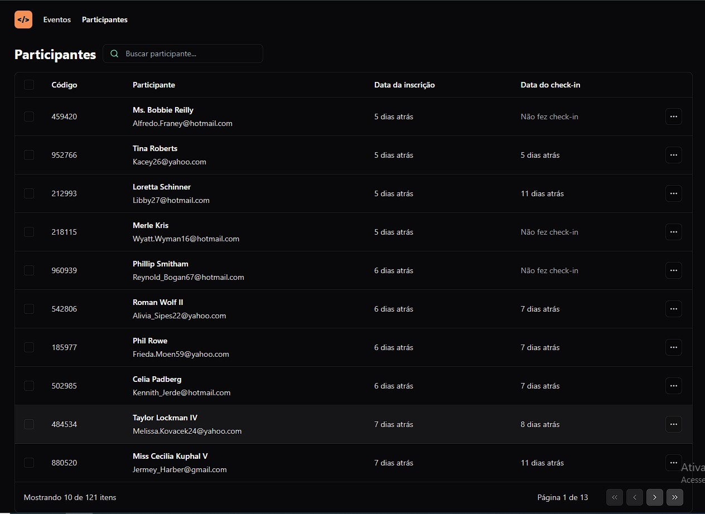
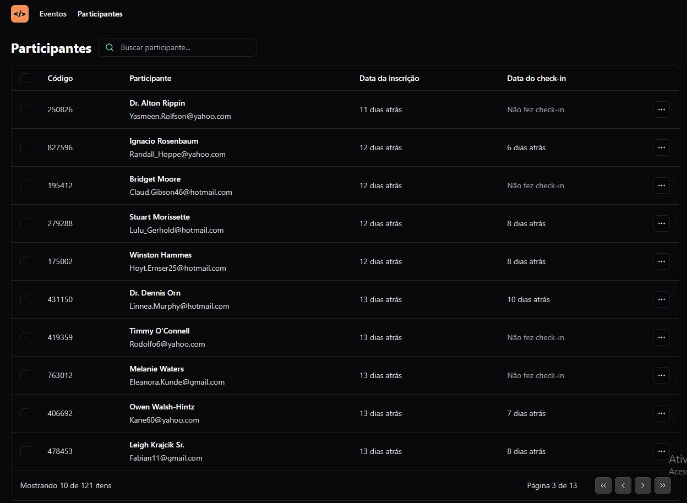
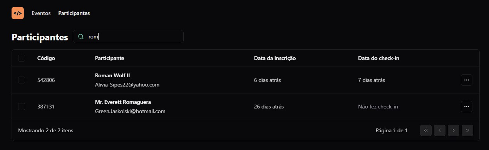
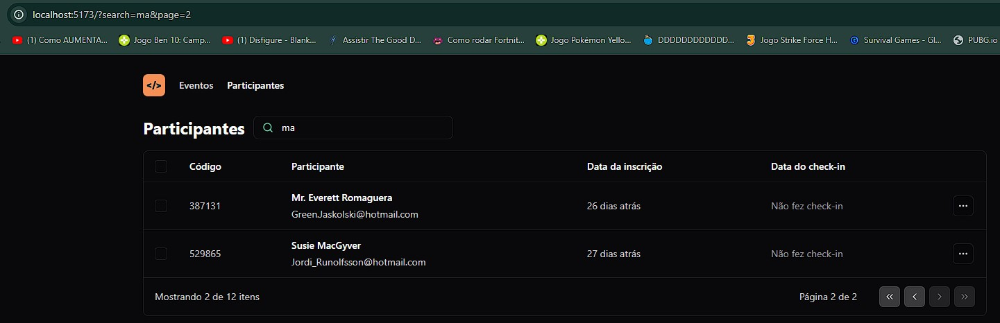
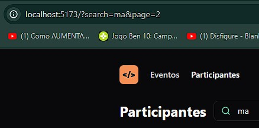

# `pass.in`

Pass.in é um app front-end, utilizando React + vite e tailwind css.

O objetivo desse projeto não era a aplicação em si, e sim os resultados no aprendizado em habilidades front-end e no ecossistema React.

## Índice

- [Funcionamento do App](#funcionamento-do-app)
- [Detalhes](#detalhes)
- [Especificações das Tencologias](#especificações-das-tecnologias)
- [Interface](#interface)
- [Iniciar aplicação](#lógica-da-aplicação)


## Funcionamento do App

É uma aplicação de gestão de participantes em eventos presenciais.

A ferramenta permite que o organizador cadastre um evento e abra uma página pública de inscrição.

Os participantes inscritos podem emitir uma credencial para check-in no dia do evento.

O sistema fará um scan da credencial do participante para permitir a entrada no evento.

Na criação o organizador do evento pode definir o número máximos de participantes que ele deseja que o evento tenha.

Para o participante fazer o check-in ele deve escanear um qr code com o celular.

## Detalhes

Essa aplicação utiliza a API desenvolvida nesse outro [repositório](https://github.com/LucasLessaAnacleto/pass.in-api).

Esse app foi feito junto ao NLW 2024, um evento gratuito da rockeatseat.

O objetivo desse projeto era aprender aspectos como:

- Compreender o ciclo de vida de um componente react melhor.
- HTML, CSS e JavaScript tudo junto em um componente, com estilização em classes do Tailwind CSS.
- Praticar a estilização de páginas.
- A utilizar os hooks 'useState' e 'useEffect' mais sabiamente.

e os principais objetivos era:

- Aprender paginação com react.
- Entender URL State e Search Params/query strings.

## Especificações das Tecnologias

Node.js como ambiente de execução.
- **v20.6.1**

Typescript, adicionando tipagem estática.
- **typescript@5.4.4**: Com ele é possível detectar erros de tipo em tempo de compilação, melhorando a legibilidade do código e facilitando a manutenção; 

Vite, uma biblioteca que utilizei para criar meu projeto React.
- **vite@5.2.8**: Oferece uma experiência de desenvolvimento extremamente rápida para projetos front-end, graças ao seu carregamento instantâneo de módulos e compilação otimizada. Ele oferece recursos muito eficientes para o desenvolvimento de apps como o "Fast Reload" e "Hot Module Replacement" (HMR);

- **@vitejs/plugin-react@4.2.1**: É um plugin para o Vite, um empacotador de módulos para o desenvolvimento de aplicativos web modernos. Esse plugin oferece suporte específico para o React, ele otimiza a compilação e o carregamento dos componentes React;

React, uma biblioteca front-end para construir interfaces.

- **react@18.2.0**: O React é uma biblioteca JavaScript de código aberto que é usada para criar interfaces de usuário, especialmente para aplicativos de página única (SPA).
Introduziu o JSX, onde é possível utilizar sintaxe do HTML direto do javascirpt, se tornando possível que os desenvolvedores criem componentes visuais customizados e reutilizáveis;

- **react-dom@18.2.0**: É uma biblioteca complementar ao React que fornece métodos específicos para lidar com a renderização de componentes React no navegador. Ela é responsável por converter os elementos React em instruções que o navegador pode entender e exibir na tela;

Tailwind como biblioteca css para aplicar estilos por classes nos componentes react.
- **tailwindcss@3.4.3**: Com o Tailwind CSS, é possível criar estilos complexos e responsivos apenas com o uso de classes HTML. Ele oferece uma grande variedade de classes utilitárias que abrangem estilos como cores, tipografia, layout, espaçamento, bordas, efeitos de hover e muito mais.

Lucide como biblioteca de ícones.
- **lucide-react@0.364.0**: Lucide fornece uma coleção de ícones vetorizados projetados para serem claros e legíveis em vários tamanhos e contextos. O pacote lucide-react parece ser uma implementação específica para React, o que significa que você pode usar esses ícones diretamente em seus componentes React como componentes JSX.

Faker js, utilizei no começo do desenvolvimento do app, até eu utilizar o back-end da aplicação.
- **@faker-js/faker@8.4.1**: Permite gerar dados aleatórios de forma realista e personalizada para facilitar o desenvolvimento e testes de aplicações. Com o Faker, os desenvolvedores podem criar dados simulados, como nomes, endereços, números de telefone, endereços de e-mail e muito mais, de acordo com suas necessidades.

## Interface

A aplicação é apenas a página que o organizador visualiza os participantes do seu evento.


<br>

Possui a parte de páginação.


<br>

E de pesquisa.


<br>

E de URL State, onde a página e a busca na barra de pesquisa ficam guardadas na URL, e se recarregar a página ou compartilhar o link para outra pessoa, ela não perde o conteúdo.


<br>

<br>

## Iniciar a aplicação  

Para iniciar este projeto, siga estas etapas simples:

### Pré-requisitos

Certifique-se de ter as seguintes ferramentas instaladas em seu sistema:
- Node.js (versão 20.X.X ou superior)
- npm (gerenciador de pacotes do Node.js)
- Ter o projeto back-end desse app rodando na máquina, seguindo esses passos [aqui](https://github.com/LucasLessaAnacleto/pass.in-api?tab=readme-ov-file#iniciar-a-aplica%C3%A7%C3%A3o) 

### Passos

1. Clone este repositório:
```bash
git clone https://github.com/LucasLessaAnacleto/pass.in.git
```
<br>

2. Dentro da pasta do projeto, instale as dependencias:
```bash
npm i
```
<br>

Agora já está tudo pronto para poder rodar a aplicação:

3. Para rodar em desenvolvimento:
```bash
npm run dev
```
<br>

4. Para produção:
```bash
npm run build
```
Com isso, é só utilizar os arquivos estáticos disponível na pasta 'dist'.

